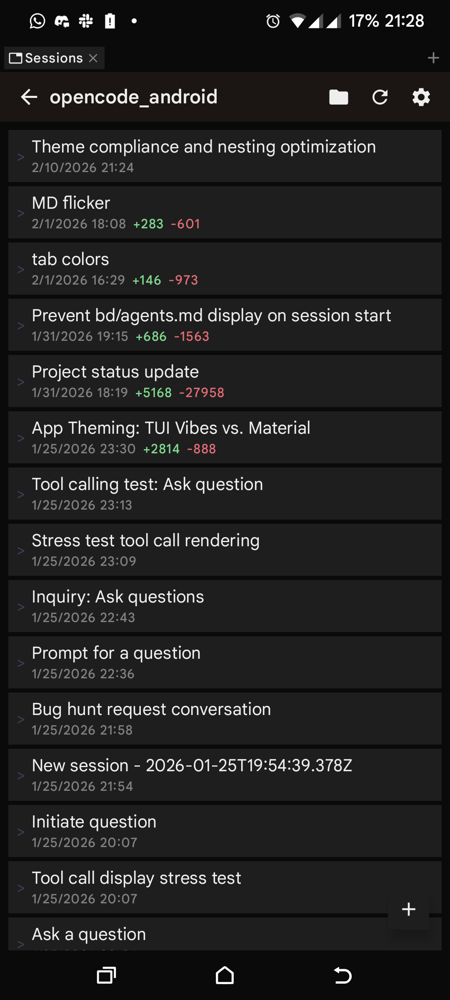
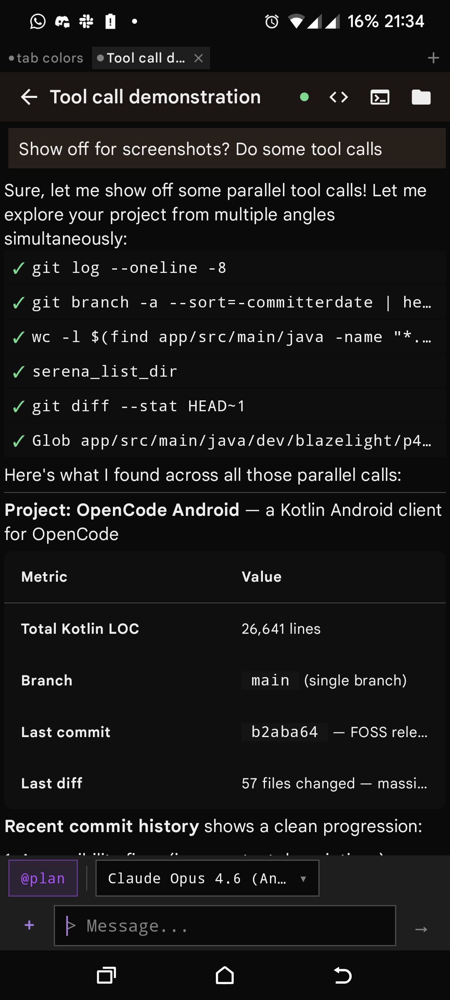

# P4OC (Pocket for OpenCode)

<a href="https://play.google.com/store/apps/details?id=dev.blazelight.p4oc">
  
</a>

An Android client for [OpenCode](https://github.com/sst/opencode), the terminal-based AI coding assistant. You point it at a running OpenCode server and talk to it from your phone.

The whole thing is built around a terminal UI aesthetic. No stock Material3 cards or rounded corners. Everything is flat, monospaced where it matters, and styled to look like it belongs in a terminal.

## What it does

You connect to an OpenCode server instance by entering its URL. From there you can:

- Chat with the AI assistant, with streaming responses via SSE
- Manage multiple sessions (create, switch, delete)
- Browse project files and view them with syntax highlighting
- View diffs from file edits the assistant makes
- Use an embedded terminal (Termux-based)
- Configure providers, models, agents, and skills
- Switch between 9 bundled color themes (catppuccin, dracula, nord, tokyonight, gruvbox, and others)

The release APK is around 2.9 MB.

## Screenshots

<p align="center">
  
  &nbsp;&nbsp;
  
</p>

## Requirements

- Android 8.0+ (API 26)
- A running [OpenCode](https://github.com/sst/opencode) server instance to connect to

## Building

You need Java 17 and the Android SDK.

```bash
# Debug build (no signing required)
export JAVA_HOME=/usr/lib/jvm/java-17-openjdk
./gradlew :app:assembleDebug
```

The APK lands in `app/build/outputs/apk/debug/`.

For release builds, create a `local.properties` file in the project root with your signing config:

```properties
RELEASE_STORE_FILE=/path/to/your/keystore.jks
RELEASE_STORE_PASSWORD=your_store_password
RELEASE_KEY_ALIAS=your_key_alias
RELEASE_KEY_PASSWORD=your_key_password
```

Then:

```bash
./gradlew :app:assembleRelease
```

## How it works

The app connects to an OpenCode server over HTTP. It uses Retrofit for REST calls and [LaunchDarkly's EventSource](https://github.com/launchdarkly/okhttp-eventsource) for SSE streaming. Messages come in as server-sent events, which the app parses and renders in real time.

The architecture is MVVM with clean architecture layers:

```
app/src/main/java/dev/blazelight/p4oc/
├── core/        # Network layer, DataStore, connection management
├── data/        # DTOs, mappers, repository implementations
├── di/          # Koin dependency injection modules
├── domain/      # Models, repository interfaces
├── terminal/    # Termux terminal emulator integration
└── ui/
    ├── components/  # Shared TUI components, markdown renderer, code blocks
    ├── navigation/  # NavGraph, route definitions
    ├── screens/     # Chat, sessions, projects, settings, terminal, files, diff
    └── theme/       # Theme system (SemanticColors, Spacing, Sizing, Typography, Motion)
```

## Theme system

The app uses a custom theme system instead of Material3's built-in theming. There are about 50 semantic color tokens (`LocalOpenCodeTheme.current`), plus `Spacing.*`, `Sizing.*`, `TuiShapes` (all 0dp corners), and `Motion.*` tokens. Themes are loaded from JSON files that follow OpenCode's theme format.

Bundled themes: catppuccin, catppuccin-frappe, catppuccin-macchiato, dracula, gruvbox, nord, opencode, tokyonight, xterm.

## Tech stack

| What | Version |
|------|---------|
| Kotlin | 2.3.0 |
| AGP | 9.0.0 |
| Compose BOM | 2026.01.01 |
| Min SDK | 26 (Android 8.0) |
| Target SDK | 35 |
| Compile SDK | 36 |

Networking: OkHttp 5.3 + Retrofit 3.0. DI: Koin 4.1. Database: Room 2.8. Serialization: kotlinx.serialization 1.10. Markdown: mikepenz multiplatform-markdown-renderer. Terminal: Termux terminal-emulator + terminal-view.

## Contributing

See [CONTRIBUTING.md](CONTRIBUTING.md).

## License

Copyright 2025 Jasmin Le Roux

Licensed under the GNU General Public License v3.0. See [LICENSE](LICENSE) for the full text.
